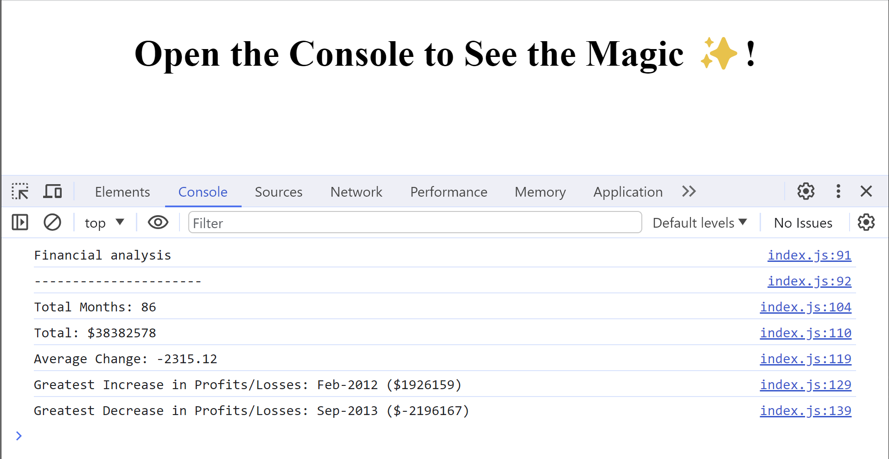

# Console finances JavaScript
## Description
This project contains code for analyzing the financial records of a company. It calculates the total amount of Profit/Loss for the given period of time, the average of the changes in Profit/Loss and the greatest increase and decrease in Profit/Loss over the enitre period.
## Instalation
N/A
## Usage
Open the Chrome DevTools by pressing Command+Option+I (macOS) or Control+Shift+I (Windows). A console panel should open either below or to the side of the webpage in the browser. There you will see the analysed data.

## Link to the depployed application
https://sonia-robin.github.io/console-finances-js/
## Credits
N/A
## Licences
N/A
